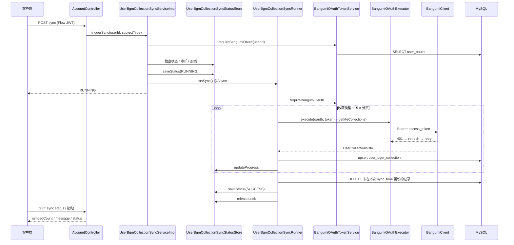

# 用户 Bangumi 收藏同步

本文档介绍 `flow-client` 模块中 **Bangumi 收藏同步** 的完整设计与实现逻辑：客户端携带 AnimeFlow Token 触发同步，服务端从 `user_oauth` 读取 Bangumi OAuth Token 拉取上游数据，异步写入本地表 `user_bgm_collection`。

---

## 1. 双 Token 模型

同步链路涉及两套互不替代的 Token：

```
客户端                          flow-client                         Bangumi / bgm.tv
  │                                 │                                  │
  │  Authorization: Bearer {Flow JWT}                                  │
  ├──────────────── POST/GET sync ───►│ JwtTokenService 校验 userId       │
  │                                 │                                  │
  │                                 │ 查 user_oauth.access_token         │
  │                                 ├──── GET /p1/collections/subjects ►│
  │                                 │     Bearer {Bangumi access_token}  │
  │◄── 任务状态 / 401(Flow) ────────┤                                  │
  │  FlowRefreshTokenInterceptor     │  401(Bangumi)                    │
  │  刷新 Flow Token 并重试          │    → refreshBangumiAccessToken   │
  │                                 │    → 写回 user_oauth 并重试一次    │
  │                                 │    → refresh 仍失败 → FAILED       │
```

| Token | 存储位置 | 用途 | 401 处理方 |
|-------|----------|------|------------|
| **Flow JWT** | 客户端 + Redis（`animeflow:auth:token:*`） | 访问 `/api/v1/account/**` | **客户端** `FlowRefreshTokenInterceptor` → `/api/v1/account/refresh` |
| **Bangumi OAuth** | MySQL `user_oauth` | 调用 `next.bgm.tv` / OAuth | **服务端** `BangumiOAuthExecutor` 统一 401 → refresh → 重试；`BangumiOAuthTokenService` 负责读写 `user_oauth` |

**注意**：Bangumi Token 刷新与 Flow Token **完全无关**。所有需 Bangumi OAuth 的上游调用应经 `BangumiOAuthExecutor.execute(...)`，401 时由执行器调用 `BangumiOAuthTokenService.refreshBangumiAccessToken` 并重试一次，业务代码（如收藏同步）不自行处理 refresh。

---

## 2. HTTP 接口

### 2.1 提交同步任务

```
POST /api/v1/account/oauth/bangumi/collections/sync?subjectType=2
Authorization: Bearer {Flow access_token}
```

| 参数 | 默认 | 说明 |
|------|------|------|
| `subjectType` | `2` | Bangumi 条目大类，2 表示动画 |

**鉴权**：`AuthorizationInterceptor` 拦截 `/api/v1/account/oauth/**`（登录接口除外），Controller 内 `jwtTokenService.validateAccessToken` 解析 `userId`。

**限流**：`@IpEndpointRateLimit`，60 秒内同一 IP 最多 5 次。

**响应**：立即返回 `UserBgmCollectionSyncStatusVo`（通常为 `RUNNING`），实际拉取在后台线程执行。

### 2.2 查询同步状态

```
GET /api/v1/account/oauth/bangumi/collections/sync
Authorization: Bearer {Flow access_token}
```

返回同一用户最近一次任务在 Redis 中的状态快照。

### 2.3 响应体 `UserBgmCollectionSyncStatusVo`

| 字段 | 类型 | 说明 |
|------|------|------|
| `status` | enum | `IDLE` / `RUNNING` / `SUCCESS` / `FAILED` |
| `userId` | long | AnimeFlow 用户 ID |
| `syncedCount` | int | 已写入/更新的收藏条数 |
| `totalCount` | int | 进度参考（各收藏类型分页 `total` 的最大值） |
| `message` | string | 人类可读说明 |
| `startedAt` | long | 任务开始时间（毫秒时间戳） |
| `finishedAt` | long | 任务结束时间（毫秒时间戳，进行中为 null） |

---

## 3. 整体流程



---

## 4. 模块职责

### 4.1 类与文件

| 类 | 路径 | 职责 |
|----|------|------|
| `AccountController` | `controller/AccountController.java` | 暴露同步/查询 API，校验 Flow JWT |
| `UserBgmCollectionSyncService` | `service/UserBgmCollectionSyncService.java` | 触发与查询入口接口 |
| `UserBgmCollectionSyncServiceImpl` | `service/impl/UserBgmCollectionSyncServiceImpl.java` | 前置校验、加锁、提交异步任务 |
| `UserBgmCollectionSyncRunner` | `service/UserBgmCollectionSyncRunner.java` | `@Async` 执行全量同步与 upsert |
| `UserBgmCollectionSyncStatusStore` | `service/UserBgmCollectionSyncStatusStore.java` | Redis 任务状态与分布式锁 |
| `BangumiOAuthTokenService` | `service/BangumiOAuthTokenService.java` | 校验绑定；refresh 并持久化 `user_oauth` |
| `BangumiOAuthExecutor` | `service/BangumiOAuthExecutor.java` | **统一** Bangumi OAuth 调用入口，401 自动 refresh 并重试一次 |
| `UserBgmCollectionSyncConfiguration` | `config/UserBgmCollectionSyncConfiguration.java` | 专用线程池 `bgmCollectionSyncExecutor` |
| `UserBgmCollectionMapper` | `mapper/UserBgmCollectionMapper.java` | `user_bgm_collection` CRUD |
| `BangumiClient` | `third-party-api` | 调用 `GET /p1/collections/subjects` |

### 4.2 线程池

```java
@Bean("bgmCollectionSyncExecutor")
// core=1, max=2, queue=50, 线程名前缀 bgm-collection-sync-
```

同步任务通过 `@Async("bgmCollectionSyncExecutor")` 提交，避免阻塞 Tomcat 工作线程。

---

## 5. 触发阶段（`triggerSync`）

`UserBgmCollectionSyncServiceImpl.triggerSync` 在提交异步任务前依次执行：

1. **绑定校验**  
   `bangumiOAuthTokenService.requireBangumiOauth(userId)`  
   - 查 `user_oauth` 且 `platform = bangumi`  
   - 无记录或无 `access_token` → 抛出 `IllegalArgumentException("未绑定 Bangumi 账号")`

2. **运行中检测**  
   Redis 状态已为 `RUNNING` → 直接返回当前状态，不重复提交。

3. **成功冷却**  
   上次 `SUCCESS` 且 `finishedAt` 距今不足 **10 分钟** → 返回原状态并设置 `message = "同步过于频繁，请稍后再试"`。

4. **分布式锁**  
   `SET NX animeflow:sync:bgm-collection:lock:{userId}`，TTL **30 分钟**。  
   - 加锁失败 → 视为任务进行中，返回 `RUNNING` 语义的状态。  
   - 加锁成功 → 初始化 `RUNNING` 状态写入 Redis，调用 `syncRunner.runSync()`。

5. **同步返回**  
   HTTP 线程立即返回，不等待 Bangumi 分页完成。

---

## 6. 执行阶段（`UserBgmCollectionSyncRunner.executeSync`）

### 6.1 拉取策略

| 维度 | 值 | 说明 |
|------|-----|------|
| 上游 API | `GET https://next.bgm.tv/p1/collections/subjects` | 对应 `BangumiNextApiPath.P1_COLLECTION_SUBJECTS` |
| 鉴权 | `user_oauth.access_token` | Bearer |
| `subjectType` | 请求参数，默认 2（动画） | 仅同步该大类条目 |
| 收藏类型 `type` | 固定遍历 `1,2,3,4,5` | 想看 / 看过 / 在看 / 搁置 / 抛弃 |
| 分页 | `limit=50`，`offset` 递增 | 直到本页为空或 `offset >= total` |

每一页通过 `bangumiOAuthExecutor.execute(oauth, token -> bangumiClient.getMeCollections(...))` 拉取。401 刷新逻辑集中在 `BangumiOAuthExecutorImpl`，同步 Runner 不包含 refresh 代码。

#### Bangumi Token 自动刷新（`BangumiOAuthExecutor`）

```
execute(oauth, apiCall)
    ↓
apiCall(access_token)
    ↓ 401 (LoginExpiredException)
refreshBangumiAccessToken(oauth)   // BangumiOAuthTokenService
    ↓
apiCall(新 access_token)           // 仅重试一次
    ↓ 仍失败
LoginExpiredException → 任务 FAILED
```

### 6.2 字段映射（Bangumi → `user_bgm_collection`）

| 表字段 | 来源 |
|--------|------|
| `user_id` | AnimeFlow 用户 ID |
| `subject_id` | `Item.id` |
| `images` | `Item.images` JSON 序列化 |
| `bgm_interest_id` | `Interest.id`（唯一键） |
| `rate` | `Interest.rate`，默认 0 |
| `type` | `Interest.type`（收藏状态） |
| `comment` | `Interest.comment`，空则 `""` |
| `tags` | `Interest.tags` JSON |
| `ep_status` / `vol_status` | `Interest.epStatus` / `volStatus` |
| `is_private` | `Interest.private` |
| `bgm_updated_at` | `Interest.updatedAt` Unix 秒 |
| `sync_time` | 本次 upsert 时间 |
| `create_time` | 首次 insert 时写入 |

**Upsert 规则**：

- 以 `bgm_interest_id` 查询是否已存在。  
- 存在 → `updateById`；不存在 → `insert`。  
- 跳过 `interest` 或 `interest.id` 为空的条目。

### 6.3 删除已取消的收藏

全部分页完成后：

```sql
DELETE FROM user_bgm_collection
WHERE user_id = ?
  AND sync_time < {本次任务开始的 LocalDateTime}
```

本次同步未 touch 到的记录视为用户已在 Bangumi 侧移除，从本地删除。

### 6.4 完成与异常

| 结果 | 行为 |
|------|------|
| 正常结束 | `status=SUCCESS`，`message=同步完成，共同步 N 条收藏` |
| `LoginExpiredException` | refresh_token 失效或刷新后仍 401，`status=FAILED`，`message=Bangumi 授权已过期，请重新绑定` |
| 其他异常 | `status=FAILED`，`message` 为异常信息或「同步失败」 |
| `finally` | 始终 `releaseLock(userId)` |

---

## 7. Redis 键设计

| 键 | 常量 | TTL | 内容 |
|----|------|-----|------|
| `animeflow:sync:bgm-collection:status:{userId}` | `Constants.BGM_COLLECTION_SYNC_STATUS_KEY` | 24h | `UserBgmCollectionSyncStatusVo` 序列化对象 |
| `animeflow:sync:bgm-collection:lock:{userId}` | `Constants.BGM_COLLECTION_SYNC_LOCK_KEY` | 30min | 分布式锁标记 `"1"` |

无 Redis 记录时，`getStatus` 返回 `IDLE`。

---

## 8. 数据库表

### 8.1 `user_oauth`（读 + 刷新时写）

绑定 Bangumi 时写入 `access_token`、`refresh_token`、`expire_time`。同步读取 access_token；若上游 401，`refreshBangumiAccessToken` 会更新上述字段。

### 8.2 `user_bgm_collection`（读写）

详见 `db/anime_flow.sql` 与实体 `UserBgmCollectionEntity`。

主要约束：

- `uk_bgm_interest_id`：Bangumi 收藏 ID 全局唯一  
- `uk_user_subject`：同一用户对同一条目仅一条记录  
- `idx_user_type`：按用户 + 收藏类型查询

---

## 9. 错误与 HTTP 状态

| 场景 | HTTP / 任务状态 | 说明 |
|------|-----------------|------|
| 未登录 / Flow JWT 无效 | 401 | `JwtTokenService` → `LoginExpiredException`，由客户端刷新 Flow Token |
| 未绑定 Bangumi | 400 或业务错误 | `IllegalArgumentException` |
| Bangumi access_token 过期 | 服务端 `BangumiOAuthExecutor` 自动 refresh 并重试 | 业务无感 |
| Bangumi refresh_token 失效 | 异步 `FAILED` | 提示用户重新绑定 Bangumi |
| 同步进行中重复 POST | 200 + `RUNNING` | 不启动第二个任务 |
| 10 分钟内重复成功同步 | 200 + 原状态 + 频繁提示 | 不启动新任务 |

Bangumi 上游 401 在 `BangumiClientImpl.blockBangumi` 中转为 `LoginExpiredException`；`BangumiOAuthExecutor` 捕获后 refresh。仅 refresh 失败时 Runner 将任务标为 `FAILED`。

---

## 10. 客户端集成建议

1. 确认已登录（Flow Token）且 Bangumi 已绑定。  
2. `POST .../collections/sync` 触发同步。  
3. 每 2~3 秒 `GET .../collections/sync` 轮询，直到 `status` 为 `SUCCESS` 或 `FAILED`。  
4. `RUNNING` 时展示 `message`、`syncedCount`（及可选 `totalCount`）。  
5. Flow 接口返回 401 时由 `FlowRefreshTokenInterceptor` 处理；Bangumi 授权过期由服务端 refresh，客户端无感知，仅可能看到同步失败需重新绑定。

AnimeFlow 客户端参考实现：

- API：`lib/http/api_path.dart` → `bangumiCollectionSync`  
- 请求：`lib/http/requests/flow_request.dart`  
- 状态：`lib/providers/user/bgm_collection_sync_provider.dart`  
- UI：`lib/pages/settings/pages/account_settings.dart` → `_BangumiCollectionSyncSection`

---

## 11. 扩展与注意事项

- **仅同步 `subjectType` 指定大类**：当前默认动画；若未来支持多类型，需调整删除策略（避免误删其他类型本地数据）。  
- **`totalCount` 为参考值**：多收藏类型分页时取各类型 `total` 的最大值，不等于精确总条数。  
- **锁 TTL 30 分钟**：极端情况下任务 hung 住，锁过期后可再次触发；正常路径在 `finally` 释放。  
- **与公开收藏 API 的区别**：`/api/v1/bangumi/users/{username}/collections/subjects` 为代理公开接口；本同步走需 OAuth 的 `/p1/collections/subjects`，数据含用户私有收藏信息。

---

## 12. 相关上游接口

Bangumi Next API：

```
GET /p1/collections/subjects
  ?subjectType={int}
  &type={1|2|3|4|5}
  &limit={int}
  &offset={int}
Authorization: Bearer {bangumi_access_token}
```

响应模型：`com.ligg.common.thirdparty.bangumi.response.UserCollectionsDto`。
