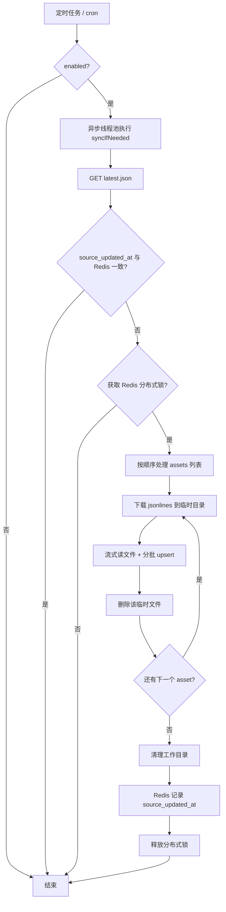

# flow-scheduler

AnimeFlow 定时任务模块，随 `flow-bootstrap` 启动。当前主要实现 **Bangumi Archive** 离线数据的定时检测与增量同步。

数据来源为 [animeFlow-assets](https://github.com/openAnimeFlow/animeFlow-assets) 仓库发布的 Bangumi wiki 归档（jsonlines），由上游 [bangumi/Archive](https://github.com/bangumi/Archive) 定期导出并经本仓库清洗后发布到 GitHub Releases。

---

## 模块职责

| 组件 | 作用 |
|------|------|
| `BangumiArchiveSyncScheduler` | 按 cron 触发同步 |
| `BangumiArchiveSyncStartupRunner` | 启动时若无 Redis 同步记录则触发一次 |
| `BangumiArchiveSyncService` | 检查是否有新数据、抢锁、编排整次同步 |
| `BangumiArchiveHttpService` | 拉取 `latest.json`、下载 Release 资源文件 |
| `BangumiArchiveJsonlinesSyncService` | 流式读取 jsonlines，分批写入数据库 |
| `BangumiArchiveLineParser` | 将单行 JSON 解析为实体 |
| `BangumiArchiveUpsertService` | 按批调用 Mapper，每批独立事务 |
| `BangumiArchiveUpsertMapper` | `insert ... on duplicate key update` 批量 upsert |

模块通过 `flow-bootstrap` 依赖引入，`@ComponentScan("com.ligg")` 会自动扫描本模块中的 `@Component` / `@Service`。

---

## 如何触发

### 1. 定时自动触发（默认）

`BangumiArchiveSyncScheduler` 使用 Spring `@Scheduled`，默认每天 **03:00** 执行一次：

```yaml
anime-flow:
  bangumi-archive-sync:
    cron: "0 0 3 * * *"
```

调度器本身只做两件事：检查 `enabled` 是否为 `true`，然后调用 `BangumiArchiveSyncService.triggerSyncAsync()`。

### 2. 启动时触发（首次部署）

`BangumiArchiveSyncStartupRunner` 在应用启动完成后检查 Redis 键 `animeflow:bangumi:archive:source_updated_at`：

- **不存在或为空** → 异步触发一次同步（适合首次部署、Redis 被清空后）
- **已存在** → 跳过，避免每次重启都重复全量导入

可通过 `run-on-startup-if-missing: false` 关闭该行为。

### 3. 异步执行，不阻塞主线程

`triggerSyncAsync()` 标注了 `@Async("bangumiArchiveSyncExecutor")`，实际同步逻辑在 **专用单线程池** 中运行：

- 核心线程数 / 最大线程数均为 1
- 队列容量为 1
- 避免与 HTTP 请求处理争抢线程，也避免多线程并发跑两份同步任务

### 4. 何时真正开始同步

定时任务触发后，**不一定**会下载数据。`syncIfNeeded()` 会依次判断：

1. `enabled == false` → 直接跳过
2. 拉取 [archive/latest.json](https://raw.githubusercontent.com/openAnimeFlow/animeFlow-assets/main/archive/latest.json)
3. 远程 `source_updated_at` 与 Redis 中已记录值相同 → 跳过（数据已是最新）
4. Redis 分布式锁已被其他实例占用 → 跳过（已有节点在同步）
5. 以上均通过 → 开始整次同步

首次部署或 Redis 无 `source_updated_at` 记录时，启动阶段会触发同步；之后仅在有新版本或 cron 触发时同步。

---

## 同步流程总览



---

## 详细步骤说明

### 第一步：获取元数据

请求配置项 `latest-url`（默认指向 `archive/latest.json`），解析为 `ArchiveLatestDto`，关键字段：

- `source_updated_at`：上游 Bangumi Archive 的更新时间，用于判断是否需要同步
- `dump_name`：当前 dump 标识，如 `dump-2026-06-09.210424Z`
- `assets`：本次需同步的文件列表，每项包含 `name`、`browser_download_url`、`size` 等

示例见：[latest.json](https://raw.githubusercontent.com/openAnimeFlow/animeFlow-assets/main/archive/latest.json)

### 第二步：并发与幂等控制（Redis）

| Redis 键 | 含义 |
|----------|------|
| `animeflow:bangumi:archive:source_updated_at` | 上次成功同步的 `source_updated_at` |
| `animeflow:bangumi:archive:sync:lock` | 分布式锁，防止多实例重复同步 |

锁默认最长持有 6 小时（`lock-ttl-seconds`）。同步结束（成功或失败）后在 `finally` 中释放锁。仅当整次 `runSync` 全部成功后，才更新 `source_updated_at`；中途失败不会更新，下次仍会重试。

### 第三步：下载与导入（按文件顺序）

根据 `assets` 中的文件名识别数据类型（`ArchiveDataType`），并按 **固定顺序** 同步，避免关联表先于主表处理：

1. `subject` → `bangumi_subject`
2. `character` → `bangumi_character`
3. `person` → `bangumi_person`
4. `episode` → `bangumi_episode`
5. `subject-characters` → `bangumi_subject_character`
6. `subject-persons` → `bangumi_subject_person`
7. `subject-relations` → `bangumi_subject_relation`
8. `person-characters` → `bangumi_person_character`
9. `person-relations` → `bangumi_person_relation`

每个 asset 的处理流程：

1. 从 `browser_download_url` **流式下载** 到 `{download-dir}/{dump_name}/` 下的临时文件
2. `BufferedReader` **逐行**读取 jsonlines（不把整个文件载入内存）
3. 每行 JSON 经 `BangumiArchiveLineParser` 转为实体
4. 累积到 `batch-size`（默认 500）后，调用 `BangumiArchiveUpsertService` 写入数据库
5. 每批之间 `sleep(batch-delay-ms)`（默认 50ms），降低对线上数据库的持续压力
6. 该文件处理完毕后 **立即删除** 本地临时文件
7. 全部 asset 完成后删除工作目录

> 说明：`subject.jsonlines` 在 animeFlow-assets 发布前已过滤为仅 `type=2`（动画条目），同步到 `bangumi_subject` 的为清洗后的动画数据。

### 第四步：写入数据库（Upsert）

通过 `BangumiArchiveUpsertMapper.xml` 中的 SQL 实现 **有则更新、无则插入**：

```sql
insert into bangumi_character (...)
values (...)
on duplicate key update
    role = values(role),
    name = values(name),
    ...
```

- 有单主键 `id` 的表（character、episode、person、subject）：按主键冲突更新
- 联合主键的关联表：按联合主键冲突更新对应字段

`BangumiArchiveUpsertService` 中每个 `upsert*Batch` 方法使用 `@Transactional(propagation = REQUIRES_NEW)`，**每一批** 为独立事务，避免单次同步占用一个超长事务锁表。

---

## 对线上服务的影响控制

| 策略 | 说明 |
|------|------|
| 错峰执行 | 默认凌晨 3 点定时跑 |
| 异步 + 单线程池 | 不占用 Web 请求线程 |
| 流式下载 / 读文件 | 大文件（数百 MB）不一次性进内存 |
| 分批 upsert | 默认每批 500 行 |
| 批次间隔 | 默认每批间隔 50ms |
| 小事务 | 每批独立提交 |
| 分布式锁 | 多实例部署时只有一个节点执行 |
| 临时文件即用即删 | 减少磁盘占用 |

---

## 配置项

在 `flow-bootstrap` 的 `application.yaml` 中配置（前缀 `anime-flow.bangumi-archive-sync`）：

```yaml
anime-flow:
  bangumi-archive-sync:
    enabled: true                                          # 是否启用同步
    run-on-startup-if-missing: true                        # Redis 无记录时启动即同步
    latest-url: https://raw.githubusercontent.com/openAnimeFlow/animeFlow-assets/main/archive/latest.json
    cron: "0 0 3 * * *"                                    # 定时表达式（每天 03:00）
    batch-size: 500                                        # 每批 upsert 行数
    batch-delay-ms: 50                                     # 批次间隔（毫秒）
    download-dir: ${java.io.tmpdir}/bangumi-archive        # 临时下载目录
    lock-ttl-seconds: 21600                                # 分布式锁 TTL（秒）
    connect-timeout-seconds: 30                          # HTTP 连接超时
    read-timeout-seconds: 3600                             # 大文件下载读超时
```

关闭同步：将 `enabled` 设为 `false`，定时任务仍会注册但不会执行实际逻辑。

---

## 目录结构

```
flow-scheduler/
├── README.md
├── pom.xml
└── src/main/
    ├── java/com/ligg/flowscheduler/
    │   ├── config/          # 定时/异步配置、Properties
    │   ├── scheduler/       # @Scheduled 入口
    │   ├── archive/         # 同步核心逻辑
    │   │   └── dto/         # latest.json 模型
    │   └── mapper/          # MyBatis Mapper 接口
    └── resources/mapper/
        └── BangumiArchiveUpsertMapper.xml
```

---

## 依赖与运行条件

- 模块依赖 `common`（实体类）、MyBatis-Plus、Redis（锁与同步版本记录）
- 需已创建 `bangumi_*` 相关表（见 `db/anime_flow.sql`）
- 需可访问 GitHub（拉取 latest.json 与 Release 下载链接）
- Redis 配置与 `flow-client` 共用（`spring.data.redis`）

---

## 日志关键字

排查同步问题时可在日志中搜索：

- `Bangumi archive scheduled sync triggered` — 定时任务触发
- `Bangumi archive is up to date` — 无需同步
- `Bangumi archive sync already running` — 锁被占用
- `Starting Bangumi archive sync` — 开始同步
- `Synced N rows from` — 单个 jsonlines 文件完成
- `Bangumi archive sync completed` — 整次同步成功
- `Bangumi archive sync failed` — 同步异常
